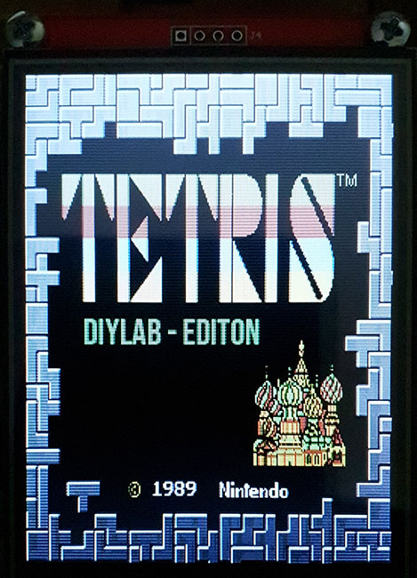
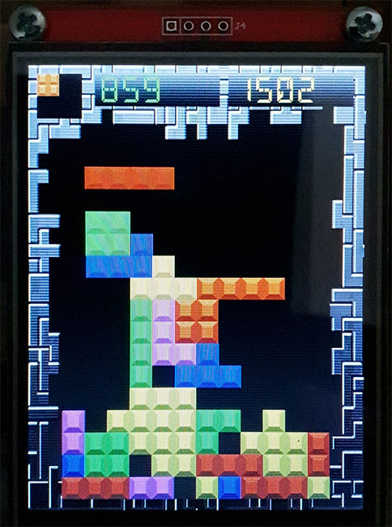
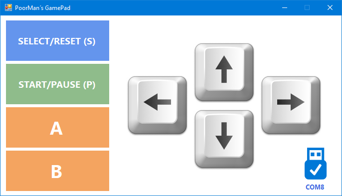

# Tetris
 **Tetris for Teensy 4.x and displays with ILI9341 controller and 240x320px resolution.**

Copyright (C) 2021 by DIYLAB <https://www.diylab.de>

 

The idea itself comes from FrankBoesing's repository "[T3TRIS](https://github.com/FrankBoesing/T3TRIS)" - thanks for the suggestion!
I ported this game to the Teensy 4.x and use Arvind's [ILI9341_T4](https://github.com/vindar/ILI9341_T4) display driver. 

### Control of the game

The game is controlled with the included Windows tool "[PoorMan's GamePad](https://github.com/DIYLAB-DE/PoorMansGamePad)". When the program finds a connected Teensy 4.x, it communicates via the USB-Serial interface.

### These components are required as a minimum

* Teensy 4.0 or Teensy 4.1
* One TFT displays with ILI9341 controller and a resolution of 320x240 px

### Display recommendations

* [3.2inch SPI Module ILI9341 SKU:MSP3218](http://www.lcdwiki.com/3.2inch_SPI_Module_ILI9341_SKU:MSP3218)
* [2.8inch SPI Module ILI9341 SKU:MSP2807](http://www.lcdwiki.com/2.8inch_SPI_Module_ILI9341_SKU:MSP2807)
* [2.4inch SPI Module ILI9341 SKU:MSP2402](http://www.lcdwiki.com/2.4inch_SPI_Module_ILI9341_SKU:MSP2402)
* [2.2inch SPI Module ILI9341 SKU:MSP2202](http://www.lcdwiki.com/2.2inch_SPI_Module_ILI9341_SKU:MSP2202)

Many other displays are also possible if they have the required connectors, have the ILI9341 controller and a resolution of 320x240 px.

### Displays connection diagram

| Display      | Teensy                                                       |
| -------------- | ------------------------------------------------------------ |
| VCC            | **3.3V** (from Teensy, better 3.3V from separate LDO) ¹     |
| GND            | **GND** (on top, between Vin and 3.3V)                       |
| CS             | **9**                                                        |
| RESET          | **6**                                                        |
| DC/RS          | **10**                                                       |
| SDI (**MOSI**) | **11**                                                       |
| SCK            | **13**                                                       |
| LED            | any available pin will do or connect to +3.3V through a small resistor 50 to 100 Ohm |
| SDO (**MISO**) | **12**                                                       |

¹ Recommended: close the jumper **J1** on the display.

### Used libraries

1. Arvind's optimized ILI9341 screen driver library for Teensy 4/4.1, with vsync and differential updates: <https://github.com/vindar/ILI9341_T4>
2. TGX - a tiny/teensy graphics library: <https://github.com/vindar/tgx>

### Used development software

* Arduino IDE 1.8.15 (always needed)
* Teensyduino, Version 1.54 (always needed, versions below 1.54 will not work)
* [optional: Microsoft Visual Studio Community 2019 + Visual Micro - Release 21.06.06.17]